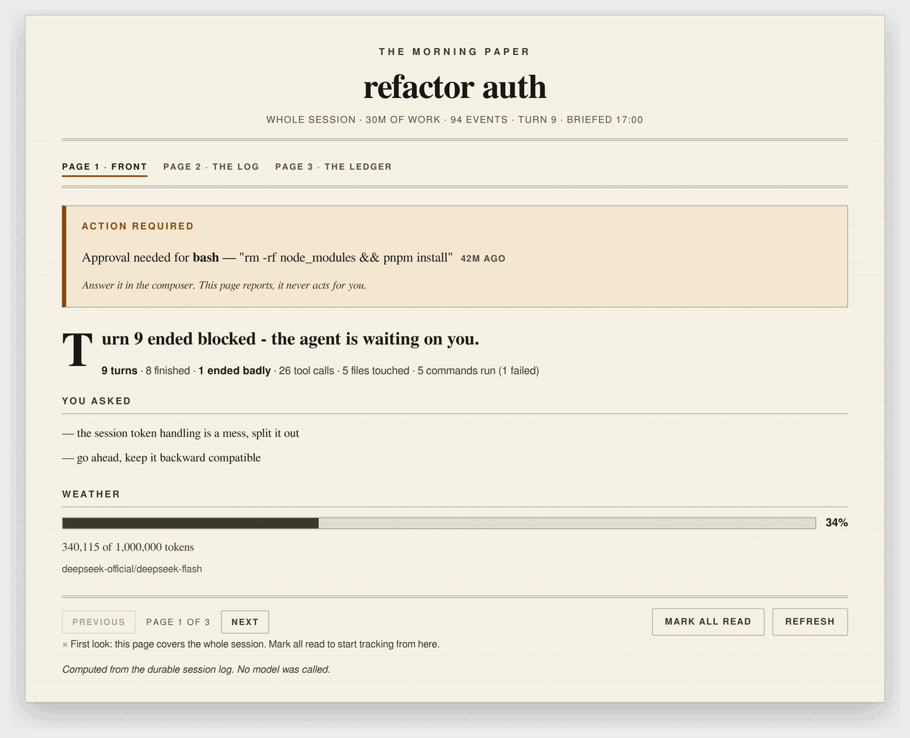
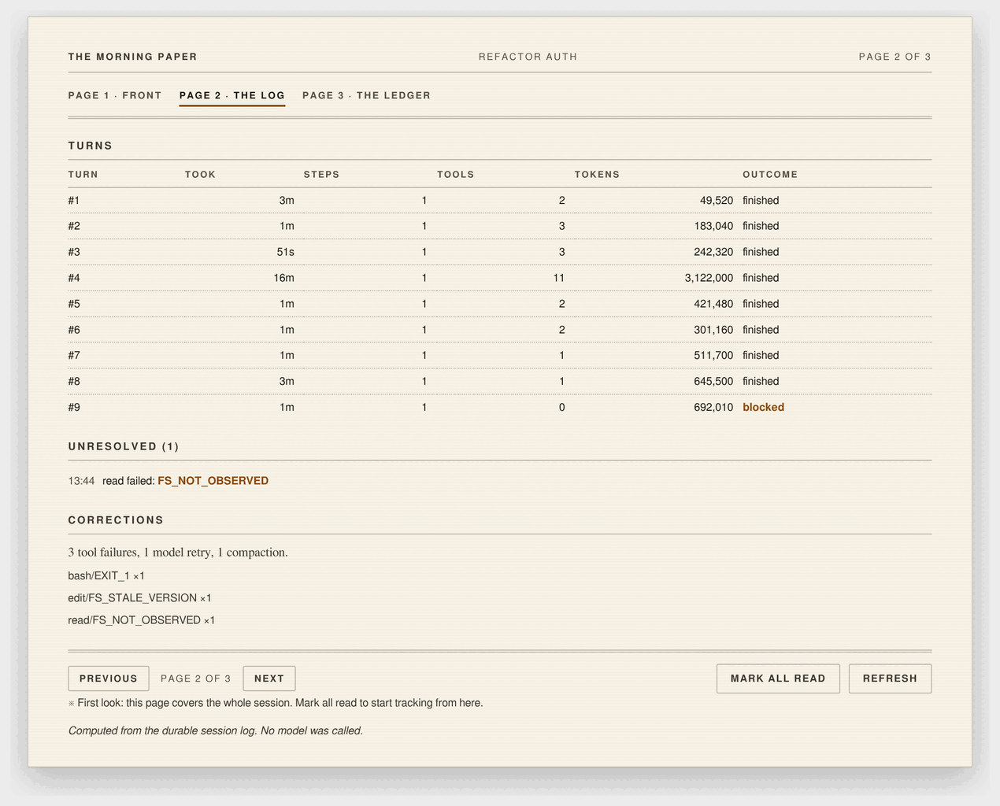
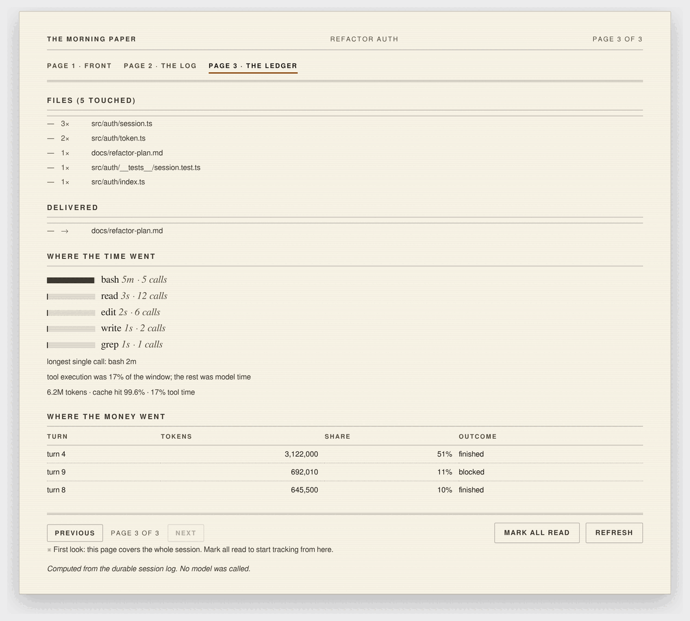

# dsh-morning-paper

[](LICENSE)
[](https://github.com/topics/dsh-plugin)

The front page for a session you left running: **what happened, what broke, and
what is waiting on you** — computed from the durable event log, never written by
a model.

It is a real Conversation View tab labelled **Morning Paper**, sitting next to
**Chat** and **Trajectory**, and it is set like a newspaper: a masthead, a
dateline, a boxed bulletin for anything waiting on you, a lede with a drop cap,
columns, and small print.



*Screenshots on this page are generated by `node tools/screenshot.mjs` from the
shipped stylesheet and render tree, so they cannot drift from the code.*

```sh
$ dsh --profile web   # …you leave the tab open and come back 42 minutes later
```

```
============================================================================
THE MORNING PAPER - refactor auth
away 42m | 751 event(s) | 28m of wall clock | turn 18 | 0 action(s) required
============================================================================

LEAD: Turn 17 completed.

WHAT IT DID
  9 turn(s): 8 finished, 0 blocked, 0 failed, 0 cancelled, 0 interrupted
  140 tool call(s), 12 file(s) touched, 79 command(s) run (0 failed)

TURNS
  turn   took    steps  tools        tokens  outcome
    10   57s         8      8     3,079,044  completed
    11   4m         35     42    13,573,537  completed
    13   9m         56     58    25,512,399  completed
    18   24s         2      1     1,131,559  open

FILES (12 touched)
   12x src/auth/session.ts
    9x src/auth/token.ts
    4x src/auth/__tests__/session.test.ts
  ... and 9 more file(s)

WHERE THE TIME WENT
  ##########......  60.6%  bash                1m   (79 calls)
  ######..........  37.8%  ask_user_question  42s   (1 calls)
  #...............   0.6%  edit                1s   (25 calls)
  longest single call: ask_user_question 42s
  tool execution was 6.5% of the window; the rest was model time

WHERE THE MONEY WENT
  turn  13    25,512,399 tokens   41% of the window  58 tools  completed
  turn  11    13,573,537 tokens   22% of the window  42 tools  completed
  turn  14     7,787,236 tokens   13% of the window  14 tools  completed

BUSINESS
  61,938,602 tokens | cache hit 99.9% | 11 message(s) from you
  delivered:
  - docs/refactor-plan.md

CORRECTIONS
  3 tool failure(s): edit/FS_STALE_VERSION x2, read/FS_NOT_OBSERVED x1
  1 model retry(ies)

UNRESOLVED (1)
  18:24  edit failed: FS_STALE_VERSION  (never retried)

YOU ASKED
  - split the session token into its own module, keep it backward compatible

WEATHER
  ########................   34%  340,115 of 1,000,000 tokens
  route: deepseek-official/deepseek-flash
```

*(Illustrative output — the shape is exactly what `/briefing` prints.)*

The tab renders that same document as a three-page newspaper; `/briefing` prints
it as plain text in the transcript. One computed briefing, two renderings.

## What it says that the chat does not

A chat is a linear list of messages. It cannot tell you:

- **which files took the churn** — `22x selftest.mjs` is a fact no single
  message contains;
- **where the wall clock went** — per-tool execution time, the longest single
  call, and the split between tool execution and model time (6.5% of the window
  above — the rest was the model thinking, which no transcript shows);
- **which single turn ate the spend** — turn 13 was 41% of a 62M-token window;
- **what failed and was never retried** — a failure followed by a later success
  of the same tool is treated as handled; one with no later success is listed
  with the exact failing command;
- **what you asked for** an hour ago, filtered to your own messages.

**It deliberately does not quote the agent's reply.** That is readable in the
chat, and restating it is what makes a briefing worthless. The lead is one line
of *outcome*; everything else is aggregation.

## Three pages

The tab is paginated like a paper, and a page only exists when it has something
to say — a quiet session is a single sheet, not three pages of nothing.

| Page | Carries |
|---|---|
| **1 · Front** | the action bulletin, the lead outcome, the what-it-did summary, what you asked, and context weather |
| **2 · The Log** | the per-turn timeline, unresolved failures with their commands, and the corrections line |
| **3 · The Ledger** | file churn, delivered files, where the time went, where the money went |

Page one gets the full nameplate; inner pages get a running head and a folio
(`Page 2 of 3`), with section links at the top and one footer row holding
previous/next beside the read controls. Switching sessions returns you to page one.



*Page 2 · The Log — the per-turn timeline, the failures nobody retried, and the
corrections line. This is the page that shows a single turn taking 16 minutes and
3.1M tokens.*



*Page 3 · The Ledger — file churn counted per file, what was delivered, where the
wall clock went, and which turns ate the spend.*

`/briefing` prints the same document as **one continuous column**, because a
transcript cannot be flipped. Pagination is presentation, not data, so the text
rendering and the tab share one computed briefing.

## Why it is trustworthy

**The briefing is computed, never generated.** Zero tokens, no hallucination,
byte-identical for the same log and clock. If you want prose about a session,
`/briefing` plus the agent can produce it — this plugin deliberately does not.

**It never enters your context.** The page is derived state. Nothing here calls
`inject()`, appends a session event, or sends anything to a model. The one path
that touches the transcript is the `/briefing` command, which you invoke. The
selftest asserts this.

## Two scope rules

A front page answers two different questions, so two different reads:

| Question | Source |
|---|---|
| *What happened while I was away?* | only events after the seq your browser last showed you |
| *What needs me right now?* | the **whole** log — an approval asked before you left is still waiting, and a turn that ended `blocked` an hour ago is still blocked |

**Fork-inherited events are excluded from the "what happened" counts and named in
a notes line.** If you forked a session, its inherited prefix did not happen
here; `readSession` reports the exact prefix length, so the page cannot inflate
your agent's work with someone else's.

## Install

From a checkout:

```sh
git clone https://github.com/damlys99/dsh-morning-paper
dsh plugin --profile web add -w link:/absolute/path/to/dsh-morning-paper
# restart dsh web, then reload the page
```

From npm (once the package is published):

```sh
dsh plugin --profile web add -w dsh-morning-paper
```

Requires DSH `>=0.1.2-alpha.1 <0.2.0-0`. The row is added to the profile
automatically; a restart is required because both the host module and the client
bundle are composed at boot, and `patchReload: live` only watches patch files.

Uninstall:

```sh
dsh plugin --profile web remove dsh-morning-paper
```

## The context ceiling

WEATHER is a gauge: a filled bar, the percentage beside it, the raw figures, and
the route it measured — because a percentage buried in a sentence is the one
thing you cannot read at a glance. It compares the session's current request
pressure against the routed model's own declared capacity. DeepSeek's adapter declares one — every model in
its catalog carries a `contextWindow`, 1,000,000 tokens on the current routes —
and the plugin reads it through `ctx.llm.resolveModelInfo()`, the same call
automatic compaction uses to decide when to compact. So the percentage is the
number DSH itself is working from, not an estimate.

The route is read from the newest `request/header` event in the log rather than
from the agent's options, because a session on the default model never sets a
provider explicitly, and the ceiling belongs to the route that actually ran.

A plugin-config ceiling is a **fallback for adapters that declare nothing**:

```yaml
# ~/.dsh/profiles/web/cordis.patch.yml
- id: morning-paper
  config:
    contextWindow: 128000
```

A model-declared capacity always wins over it, and a configured one is labelled
wherever it is shown because it is an assumption rather than a fact. An invalid
value is ignored. With neither, the page reports the token count and says the
ceiling is unknown rather than inventing a percentage.

## The command

```sh
/briefing                 # the whole session, as text in the transcript
/briefing --since 812     # only what happened after seq 812
```

## What reads what

| Need | Seam |
|---|---|
| The log | `ctx.sessionQuery.readSession()` — concrete, so no search backend is required |
| The log tail | `ctx.sessionQuery.listEvents()` — metadata only; the cheap half of the auto-refresh poll |
| The title | `ctx.sessionQuery.readTitle()` |
| Pending approvals | durable `approval/asked` minus `approval/decided` — survives a host restart |
| Turn outcome | `turn/end` reasons: `completed`, `blocked`, `error`, `aborted`, `max-tokens`, `interrupted` |
| Failures, retries, compactions | `tool/result.error`, `llm/retry*`, `compaction/*` |
| Cost | `assistant/message.usage` — disjoint input / cache-read / cache-write / output buckets |
| Context pressure | `ctx.tokenMeter.measure()` + `ctx.llm.resolveModel()` for the model's declared window |
| Pending questions | the live `user-questions/request` waterfall (in memory only — see limits) |
| The route | `ctx.webServer.register({ kind: 'exact', path: '/morning-paper' })` |
| The page | `conversation.view`, one tab labelled **Morning Paper**, next to Chat and Trajectory. No DOM decoration, no `MutationObserver` |

Optional services (`agents`, `tokenMeter`, `llm`, `commands`) are resolved with
`ctx.get` at use time. A composition without them still mounts and still serves
the durable half of the page; a headless profile loses only the weather line.

## Refusals

Every guard runs before any work, so a refused request changes nothing.

| Code | Status | When |
| --- | --- | --- |
| `BAD_REQUEST` | 400 | Missing or malformed `sessionId` / `sinceSeq` / `format` |
| `SESSION_NOT_FOUND` | 404 | No live or persisted session with that id |
| `MARKER_AHEAD` | 409 | Your reading marker is past the log tail. The browser forgets the marker and shows the whole session rather than a stale page |
| `LOG_TOO_LARGE` | 413 | Above 20,000 events, which is more than this plugin will read in one request |
| `SUBAGENT_OWNED` | 409 | A subagent session's briefing belongs to its parent |
| `BRIEFING_FAILED` | 502 | The log could not be read |

## Deliberate limits

- **Pending *questions* are live-only.** `dsh-user-questions` declares no durable
  session event, so a pending question cannot be found in a cold log after a host
  restart. The watermark is set when the waterfall opens and cleared when it
  settles, so it can never nag about a question you already answered — but it is
  also absent after a restart. Approvals have no such limitation.
- **No full-text search.** `dsh-session-query-sqlite` ships mounted with
  `openAt: never`, so this plugin uses only the concrete reads and depends on no
  search backend.
- **Windows are truncated, not refused.** Above 5,000 new events the page
  summarises the newest 5,000 and says so in a note.
- **`readSession` clones the whole log.** That is the ceiling that produces
  `LOG_TOO_LARGE`; if it bites on real sessions, the fallback is a tail read of
  the JSONL, which would couple this plugin to the on-disk format.

## Page behaviour

- **A first visit shows the whole session.** A page that greets you with silence
  reads as broken, so the first render is the full history and the small print
  says so. `Mark all read` starts the tracking window from that point.
- **After that, the window is yours.** The dateline reads
  `since 18:12 · away 3h 12m` and covers only what happened since you last read
  it; a whole-session read says `whole session · 45m of work` and never claims an
  away duration it did not measure.
- **It refreshes itself.** A turn that just ended is read a beat after the run
  state flips; while the agent is working the tab polls every 5s, every 20s when
  idle, and immediately when you come back to it. The recurring poll asks the
  host for the **log tail only** — the expensive log read happens only when the
  tail actually moved — and nothing is polled while the tab is in the
  background.
- **`Mark all read` never blanks the page.** It advances the reading marker and
  leaves what you just read on screen, with a line saying when you marked it; the
  next new events appear on the following refresh. The previous behaviour —
  clearing the page on the click — read as "my paper just vanished".
  `Show whole session` forgets the marker to re-read everything.
- **The footer is one row**, like a paper's folio line: page navigation on the
  left, the read/refresh controls on the right, with the small print beneath it.
  A single-sheet paper shows no navigation at all.
- **A quiet session still renders a page** saying there is no news, rather than an
  empty tab that looks broken.
- **It never acts for you.** An approval item tells you what is waiting and where
  to answer it; the page does not re-implement the approval surface.
- **The palette is fixed, not themed.** A newspaper is cream paper with dark ink
  in every theme, so the sheet and the ink are literal values rather than theme
  tokens. Every text tier is contrast-checked in the selftest: body ink **15.7:1**,
  secondary **10.4:1**, the faint tier **7.2:1** on the sheet, and the accent
  heading **5.6:1** on the bulletin tint.
  This is a deliberate correction: the first version mixed the sheet from
  `--dsw-alias-*` variables whose names I had guessed, and `--dsw-alias-bg-elevated`
  / `--dsw-alias-border-secondary` do not exist, so the sheet fell back to cream
  while the label token resolved light — unreadable. The selftest now fails if the
  palette ever depends on a theme token again.

## Tests

```sh
node selftest.mjs         # 131 assertions, no network, no browser, no build
node verify-real-log.mjs  # build briefings from the session logs on this machine
node tools/screenshot.mjs # regenerate the images on this page (repo tool)
```

`tools/screenshot.mjs` renders the three pages with the shipped `PAPER_CSS` and
`paperTree`, photographs them with headless chromium, and rewrites
`screenshots.json`. It needs a chromium binary and ImageMagick, so it is a repo
tool rather than runtime code, and it is excluded from the published package.

`selftest.mjs` covers the pure core, every refusal, the request decoder, the HTTP
surface, the live watermark, the command, the text renderer, and the **real
client bundle** evaluated in a `node:vm` sandbox — including its render tree,
built with a test element factory, and the stylesheet, so page content and
styling are covered without React.

`verify-real-log.mjs` reads the logs DSH actually wrote under
`$DSH_HOME/sessions/` and builds a briefing from each, checking determinism,
non-mutation and renderability on real event payloads. It is a dev tool: session
logs are concatenated zstd frames, so it shells out to the `zstd` CLI, which the
plugin itself never does — the plugin reads through `ctx.sessionQuery`.

Real-log verification has already earned its keep twice:

- it caught the page emitting a non-ASCII truncation marker and unsanitized model
  text, so quoted content is now stripped of control characters and clipped with
  an ASCII marker;
- it caught the tool-call id being read from the wrong place. The id lives at
  `tool/result.message.source.callId`; without it there was no pairing, no
  per-tool timing, no command counting, and failure groups had no tool name. The
  entire *Where the time went* section exists because real data found that.

## Caveats

- **The route discloses session content to any caller on the loopback
  interface.** `GET /morning-paper?sessionId=…` returns a session title, file
  paths, failing commands, failure codes and token counts without the
  GUI's session cookie — the same posture as the rest of the plugin HTTP surface,
  but the payload here is conversation content, so it is worth stating plainly.
  Session ids are unguessable UUIDs, the response is derived and capped, and a
  cross-site browser request is blocked because the response carries no CORS
  headers. If you bind this port beyond loopback, treat the whole plugin HTTP
  surface as trusted-network-only, not just this plugin.
- **The page is a `conversation.view` entry.** That slot id and its `label`
  option are published contracts in `docs/subsystems/slots.md`, not private
  markup — unlike a DOM-decorating plugin, a restructured composer or dock cannot
  break this one.
- **The stylesheet is injected, not bundled.** One `<style>` element with a
  `dmp-` class prefix is appended to `document.head` on first render. There is no
  CSS file and no build step, so there is no CSS-module contract to depend on.
- **Verified against DSH `0.1.5-rc.1` contracts**, in a browser-less harness and
  against real session logs, and then used in a live browser — that pass is what
  produced the footer, read-state and dateline corrections above.
- **Not published to npm yet**, so the checkout install above is the working path
  today.

## License

MIT
